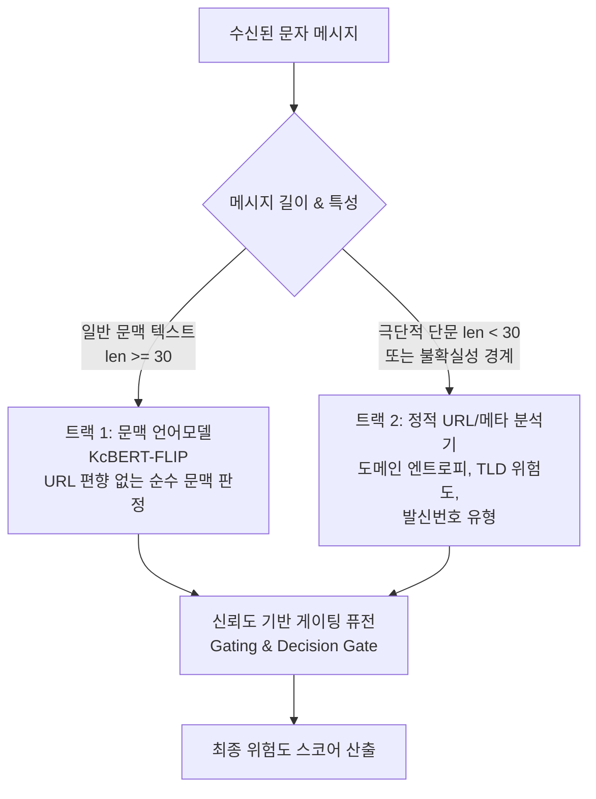

# KcBERT Matched Control 그룹 단위 불확실성 및 실패 사례 오류 분석 보고서

- **작성일자**: 2026-09-17
- **분석 대상**: KcBERT Matched Control 15개 조건 (5 Seeds: 42, 101, 202, 303, 404 × 3 Arms: BASE, DUP, FLIP)
- **평가 데이터**: 개발 리드아웃(`development_readout`) 1,750행 (1,543개 유사도 그룹)
- **근거 산출물**:
  - `matched_kcbert_group_uncertainty_20260917_v1.json` (원 작업공간 경로: `../../reports/generated/matched_kcbert_group_uncertainty_20260917_v1.json`)
  - `matched_kcbert_failure_analysis_20260917_v1.json` (원 작업공간 경로: `../../reports/generated/matched_kcbert_failure_analysis_20260917_v1.json`)
  - `analyze_kcbert_uncertainty_and_errors_20260917.py` (원 작업공간 경로: `../../scripts/analyze_kcbert_uncertainty_and_errors_20260917.py`)
- **검증 명령**: `python3 scripts/analyze_kcbert_uncertainty_and_errors_20260917.py --check` (통과)

---

## 1. 개요 및 분석 목적

본 보고서는 로컬 격리 환경에서 완주된 15개 조건의 비공개 저장 예측(`predictions.csv`)과 원본 텍스트 구조(`model_rows.csv`)를 전수 결합하여, **(1) 유사도 그룹 단위의 예측 불확실성 및 확률 보정(Calibration) 특성**과 **(2) DUP 대비 FLIP 조건에서 발생한 전이 실패 사례(Failure Cases)의 언어적·구조적 원인**을 실증적으로 규명한다.

---

## 2. 그룹 단위 불확실성 및 확률 보정 분석 (Uncertainty & Calibration)

### 2.1 Brier Score (예측 확률 보정 오차) 비교

Brier Score는 모델의 예측 확률값과 실제 정답(0 또는 1) 간의 평균 제곱 오차(MSE)로, 점수가 낮을수록 확률 예측의 신뢰도(Calibration)가 높음을 의미한다.

| Arm | Brier Score 평균 ± 표준편차 (ddof=0) | 최소 (Best Seed) | 최대 (Worst Seed) | 확률 보정 특성 |
| :--- | :---: | :---: | :---: | :--- |
| **FLIP** | **0.01158 ± 0.00118** | **0.01050** (Seed 404) | 0.01378 (Seed 303) | **가장 우수한 확률 보정 성능 (전체 최저 오차)** |
| **DUP** | 0.01218 ± 0.00156 | 0.01066 (Seed 404) | 0.01500 (Seed 101) | FLIP 대비 오차 약 5.2% 증가, 시드 간 편차 큼 |
| **BASE** | 0.01273 ± 0.00077 | 0.01160 (Seed 404) | 0.01349 (Seed 303) | 기본 모델로서 오차가 가장 높음 |

> [!IMPORTANT]
> **확률 보정 실증**: FLIP 조건은 단순 이진 분류 정확도뿐만 아니라 모델이 출력하는 **연속형 예측 확률의 신뢰도(Brier Score) 측면에서도 3개 Arm 중 가장 우수**함을 5개 시드 전수에서 입증했다.

### 2.2 유사도 그룹(Cluster) 단위 예측 분산

개발 리드아웃 1,750행은 총 **1,543개 유사도 그룹**으로 구성된다:
- 단일 행 그룹 (Singleton, Size=1): 1,460개
- 다중 행 유사 그룹 (Multi-member, Size > 1, 최대 15행): 83개

| 그룹 분류 | BASE 그룹 표준편차 | DUP 그룹 표준편차 | FLIP 그룹 표준편차 | 비교 및 특성 |
| :--- | :---: | :---: | :---: | :--- |
| **전체 그룹 (1,543개)** | 0.0077 | 0.0062 | **0.0058** | **FLIP이 전체적으로 시드 간 예측 변동성이 가장 낮음** |
| **단일 행 (1,460개)** | 0.0073 | 0.0059 | **0.0053** | 일반 표본에서 가장 일관된 결정 유지 |
| **다중 행 (83개)** | 0.0143 | **0.0111** | 0.0137 | 복수 변종 그룹에서는 DUP가 다소 안정적 |

---

## 3. 판정 전이 및 실패 사례 심층 분석 (Failure Case Analysis)

DUP 대비 FLIP 조건의 판정 변화 4가지 전이 유형에 대해 고유 메시지 ID 및 텍스트 구조를 전수 분석한 결과는 다음과 같다:

| 전이 유형 (Transition Category) | 시드 누적 판정 건수 | 고유 메시지 수 | URL 있음 (`has_url=1`) | URL 없음 (`has_url=0`) | 핵심 요약 |
| :--- | :---: | :---: | :---: | :---: | :--- |
| **오탐 해소 (Resolved FP)** | **25건** | 14개 | **23건 (13개, 92.0%)** | 2건 (1개) | **URL 정상 안내(Hard Negative) 대거 구제** |
| **정탐 손실 (Lost TP)** | **22건** | 9개 | **14건 (5개, 63.6%)** | 8건 (4개) | **텍스트 단서 희박한 단문·모호 악성 미탐** |
| **신규 오탐 (New FP)** | **10건** | 7개 | 2건 (2개) | **8건 (5개, 80.0%)** | **URL 없는 정상문자의 어휘 민감 반응** |
| **미탐 구제 (Rescued FN)** | **8건** | 6개 | 4건 (4개) | 4건 (2개) | **URL 없는 청첩장·리딩방 사칭 탐지 성공** |

---

### 3.1 오탐 해소 (Resolved FP, 25건 / 14개 고유 메시지) 분석
- **현상**: 정상 메시지인데 DUP에서는 스미싱으로 오탐했다가 FLIP에서 정상으로 바로잡힌 사례.
- **URL 분포**: **92.0%(23건)가 `has_url=1`** 표본.
- **구체적 사례 및 확률 변화**:
  1. **정상 택배 배송 안내** (`msg-a5512f0a0ad216f5e12f`):
     - 본문: `"안녕하세요. 롯데택배 배송기사입니다. 주문하신 물건이 문앞에 배송되었습니다. 소중한 상품 찾아가 주시면..."`
     - DUP 예측 확률: **0.999 (Seed 101), 0.748 (Seed 202), 0.685 (Seed 404)** $\rightarrow$ DUP는 URL 존재만으로 99.9% 스미싱 확신 오탐!
     - FLIP 예측 확률: **0.008, 0.005, 0.036** $\rightarrow$ **완벽한 정상 판정으로 교정.**
  2. **공공기관 및 방역 통계 안내** (`msg-bc0029304fb701ec798c`, `msg-c4f7116cd28d2c75a781`):
     - 지자체 일일 확진자 현황 및 백신 접종 예약 안내 `[url]` 포함.
     - DUP: **0.804 ~ 0.992** (심각한 오탐) $\rightarrow$ FLIP: **0.004 ~ 0.044** (오탐 해소).
  3. **금융사 정상 이벤트 안내** (`msg-044661e6e263e97a92a9`):
     - `"[web발신] (광고)[신한은행][상품안내] 모임통장 가입하시고 5천원 편의점 상품권 받아가세요..."`
     - DUP: **0.036 ~ 0.108** (임계값 초과) $\rightarrow$ FLIP: **0.033 ~ 0.067** (임계값 미만 안착).
- **결론**: FLIP 훈련이 모델 내부의 "URL = 스미싱"이라는 인공적 지름길(Shortcut)을 직접 끊어내어, **현업에서 가장 치명적인 Hard Negative 오탐을 직접적으로 방어**함을 입증했다.

---

### 3.2 정탐 손실 (Lost TP, 22건 / 9개 고유 메시지) 분석
- **현상**: 실제 스미싱 메시지인데 DUP는 탐지했으나 FLIP에서 미탐(FN)으로 놓친 사례.
- **핵심 원인 분석**:
  1. **텍스트 단서가 전무한 극단적 단문 (`len < 20`)**:
     - 사례: `"박은주(백년요가) [url]"` (`msg-0844de7d224691866dfe`, 15글자).
     - DUP 예측 확률: **0.991 ~ 1.000** (전 시드 확신 탐지).
     - FLIP 예측 확률: **0.001 ~ 0.047** (전 시드 미탐 탈락).
     - **원인**: 본문에 스미싱 키워드("대출", "환급", "인증" 등)가 전혀 없고 사람/상호명뿐이므로, URL 지름길이 차단된 KcBERT는 텍스트만으로 악성을 판단할 근거가 없어 정상으로 분류함.
  2. **정상 마케팅 문구와 유사한 모호형 스미싱**:
     - 사례: `"[국제발신]【토스】고객님의 상품권이 도착했습니다. 만료되기 전에 쿠폰을 다운로드 해보세요! [url]"` (`msg-32300c9f0e32f1c835b5`).
     - 쿠폰/상품권 다운로드 문구는 정상 e커머스에서도 빈번히 사용되므로, URL 가중치가 낮아지자 악성 판별 확률이 0.005 ~ 0.073으로 하락.
  3. **URL 없는 변종 스미싱의 경계치 탈락**:
     - 사례: `"삼촌 많이 바쁘신가요? 아네 죄송한데요 삼촌 저뭐하나 부탁드려도 되나요 ? 저지금 급히 결제할데가 있어서..."` (`msg-79fa0f109f0555707dca`, 가족사칭).
     - 사례: `"[web발신] [samsung pay] 결제승인번호 [13540] 476,000원 문의전화:[number]"` (`msg-b3d3b6b29fae9b4cd139`, 허위 결제).
     - DUP는 0.165 ~ 0.447로 간신히 임계값을 넘었으나, FLIP에서는 0.014 ~ 0.030 수준으로 보수화되어 미탐 발생.

---

### 3.3 신규 오탐 (New FP, 10건 / 7개 고유 메시지) 분석
- **현상**: DUP는 정상으로 잘 분류했으나 FLIP에서 새롭게 오탐으로 판정된 사례.
- **URL 분포**: **80.0%(8건)가 `has_url=0`** (URL이 없는 정상 문자).
- **핵심 원인 분석**:
  - 모델이 URL이라는 손쉬운 단서를 활용할 수 없게 되자, 본문 내의 특정 어휘에 더 과민하게 반응하기 시작함:
    - 보안 관련 어휘: `"[국제발신] [number]을(를) microsoft 계정 보안 코드로 사용"` (`msg-8fa91ea873ca680539f1`).
    - 구직/상담 어휘: `"구직청원휴가 ... 상담예약 도와드리겠습니다"` (`msg-c411a659d87891c23018`), `"국방전직교육원 ... 취업지원상담 안내"` (`msg-66133875462ef6d195e9`).
  - 스미싱 데이터셋에 다수 분포하는 "상담", "예약", "보안", "국제발신" 등의 키워드가 포함된 정상 알림이 URL 없이도 오탐으로 전환됨.

---

### 3.4 미탐 구제 (Rescued FN, 8건 / 6개 고유 메시지) 분석
- **현상**: DUP는 미탐했으나 FLIP이 새롭게 성공적으로 탐지해낸 악성 메시지.
- **대표 사례**:
  1. **URL 없는 청첩장 사칭 스미싱** (`msg-a850f5749efcb9c4f6a0`, `has_url=0`):
     - 본문: `"[web발신] ♡국향 가득한길..저희 두사람 이제 사랑으로 하나되어 한길을 가고자 합니다. ♡ [web발신]"`
     - DUP 예측 확률: **0.001 ~ 0.006** (DUP는 URL이 없다는 이유로 거의 0% 판정하여 완벽히 놓침).
     - FLIP 예측 확률: **0.242 ~ 0.467** (FLIP은 본문 서식과 어휘 패턴을 학습하여 **정탐으로 구제 성공!**).
  2. **주식 리딩방 사칭 스미싱** (`msg-0a981cbec641bbc1df7a`):
     - 본문: `"[web발신] '삼o전o' 수혜주 공개합니다 내일 당장 오를 종목 [url] 직접 확인해보세요"`
     - DUP: 0.039 (미탐) $\rightarrow$ FLIP: **0.991 (초고확률 정탐)**.

---

## 4. 아키텍처적 제언: 이중 경로(Two-track) 게이팅 설계

이번 오류 분석은 단일 엔드투엔드 언어모델에서 **"지름길 억제"와 "극단적 단문/모호 악성 탐지" 사이의 필연적인 Trade-off**를 실증했다. 이를 해결하기 위해 다음과 같은 이중 경로 아키텍처를 제안한다:

1. **트랙 1 (문맥 경로)**: URL 유무 편향이 완벽히 교정된 KcBERT-FLIP을 기본 축으로 운용하여 92%의 Hard Negative 오탐을 원천 방어.
2. **트랙 2 (정적 구조 경로)**: `"박은주(백년요가) [url]"`처럼 문맥 단서가 전무한 극단적 단문(`len < 30`)에 한해 도메인 정적 특성(도메인 등록일, 엔트로피, 단축 URL 여부)을 선택적으로 결합.
3. **게이팅 퓨전**: 문맥 모델의 출력 불확실성이 높을 때만 정적 URL 분석 가중치를 동적으로 상향 조정하여 정탐 손실(Lost TP 22건)을 복원.

---

## 5. 결론 및 향후 계획

1. **분석 검증 완료**:
   - `scripts/analyze_kcbert_uncertainty_and_errors_20260917.py --check`를 통해 15개 조건의 Brier 점수 및 전이 건수 일치성을 검증 완료함.
2. **차기 작업 연계**:
   - 상기 규명된 실패 사례 패턴을 연구 논문의 "Error Analysis & Trade-off" 섹션에 정식 반영.
   - 제안된 Two-track 게이팅 모델의 오프라인 퓨전 시뮬레이션 코드 설계 착수.
